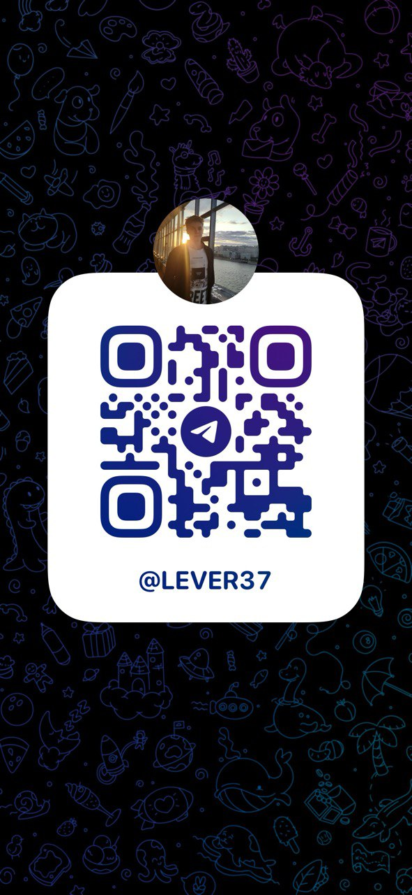

# Test task Heads&Hands 

## Описание
Данный репозиторий содержит реализацию классов для видеоигры в рамках тестового задания для поступления в школу разработки Heads x Hands. Проект решает задачи моделирования игровых сущностей (Игрок и Монстры) и их взаимодействия в бою в соответствии с заданными условиями.

## Функциональность и особенности
  
Создание Существ: Реализованы классы для создания и хранения информации о существах в игре, включая Игрока и Монстров.
Характеристики Существ: Каждое существо обладает параметрами атаки, защиты, здоровья и урона.
Взаимодействие в бою: Реализован алгоритм взаимодействия между существами в бою с учетом атаки, защиты и урона.
Исцеление Игрока: Игрок может исцеляться до 4-х раз на 30% от максимального здоровья.

### Автор

Копотев Лев
@lever37

